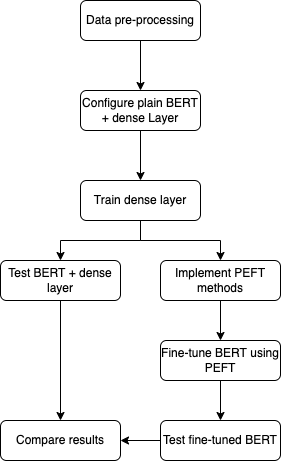

# Information Retrieval Project 2023 - 2024
This repository contains the results of a project undertaken by [Julian Roddeman](https://github.com/JulianRodd), [Janneke Nouwen](https://github.com/JannekeNouwen) and [Daan Brugmans](https://github.com/daanbrugmans) for the Radboud University course [NWI-I00041 Information Retrieval](https://www.ru.nl/courseguides/science/vm/osirislinks/i00/nwi-i00041/) for the school year 2023-2024. 
This project serves as a way for students of the Information Retrieval course to get acquainted with the topic of Information Retrieval in practice. 

## Project Topic
The project you find here is about researching the possibilities of building Information Retrieval (IR) models based on Large Language Model (LLM) technologies that can adapt to information domains that it has not been trained on. 
[A currently (2023) recent study performed by *Thakur et al.*](https://openreview.net/forum?id=wCu6T5xFjeJ) shows that LLM-based IR models, both dense and sparse, have worse performance in out-of-domain settings than in-domain-settings. 
That is, LLM-based models seem to perform worse when presented with knowledge domains that they have not been trained on. 
To counteract this, [Parameter Efficient Fine Tuning (PEFT)](https://huggingface.co/blog/peft) methods have been developed. 
PEFT methods finetune a small fraction of an LLM model's parameters as opposed to all parameters, which would be very computationally expensive. 
This project aims to research how PEFT methods can be used to finetune LLM-based IR models on unseen domains as to improve their ranking capability. 
This is done by applying PEFT methods on a heterogeneous dataset of domains that an existing model has not been trained on before.

## Research Approach
In order to conduct the research required for this project, we adhere to the predefined research approach.
This approach is defined in the following graph:

